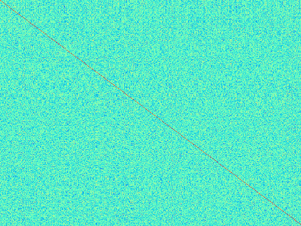
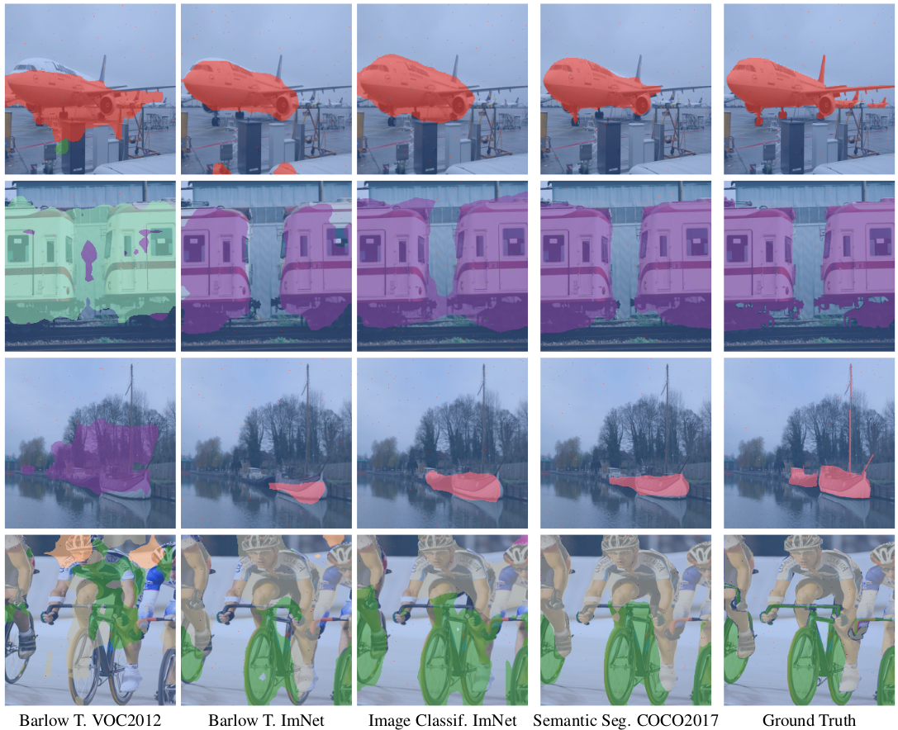

# Study of the Emerging Properties of Self-Supervised Vision Transformers and Semantic Segmentation 
Authors : Clement Apavou & Arthur Zucker


|| |
|---|---|
|Dino pretrained attention maps with a patch size of 8. Credits to Apavou & Zucker | Dino pretrained attention maps with a patch size of 16. Credits to Apavou & Zucker |


<p align="center">
  
</p>
<p align="center">
  "Effective receptive fields of 8 layers of the deeplabv3 architecture. Credits to Apavou & Zucker"
</p>
<p align="center">
   
</p>
<p align="center">
  Cross correlation matrix obtained by training a ViT with Barlow Twins, initialized with DINO weights. Refer to brisk-valley-111 experiment. Credits to Apavou & Zucker
</p>


|| |
|---|---|
|Predictions for a set of 4 images from the validation dataset using 4 different ResNet-50 backbones and a deeplabv3 head. Credits to Apavou & Zucker | Predictions for a set of 4 images from the validation dataset using a ViT-S/8 backbones and 4 different heads. Credits to Apavou & Zucker |


# Abstract 

Self-supervised learning using transformers has shown interesting emerging properties and learn rich embeddings without annotations. Most recently, Barlow Twins proposed an elegant self-supervised learning technique using a ResNet-50 backbone which achieved competitive results when fine-tuned on downstream tasks. In this paper, we propose to study Vision Transformers trained using the Barlow Twins self-supervised method, and compare the results with. We demonstrate the effectiveness of the Barlow Twins method by showing that networks pretrained on the small PASCAL VOC 2012 dataset are able to generalize well while requiring less training and computing power than the DINO method. Finally, we propose to leverage self-supervised vision transformers and their semantically rich attention maps for semantic segmentation tasks.

# Project report 

You can find the complete project report in the repository or click [here](FPR_Apavou_Zucker.pdf). Our slides are also available [here](https://docs.google.com/presentation/d/1MvE78E8pb4XEIMQxZLkBZnLMXvVNC8E-m7rnxW5wa8Q/edit?usp=sharing).

# Experiments

Ours experiments are available on wandb [here](https://wandb.ai/recvis/sem-seg?workspace=user-clementapa).

# Setting up the environment 

We exported the required packages in a `requirement.txt` file that can be used as follows : 
```
pip install -r requirements.txt
```

# Training 

Refer to the [Barlow Twins Wiki](
https://github.com/ArthurZucker/RecvisProject/wiki/Barlow-Twins-Training) and the [Semantic Segmentation Wiki ]() for more details

# Contributions 

We implemented the global structure and the Barlow Twins method from scratch in PyTorch Lightning, our visualization of the attention maps is inspired from the official [DINO repository](https://github.com/facebookresearch/dino). Our `trainer` module takes care of initializing the lightning module and the datamodule, both of which can be chosen in our configuration file (`config/hparams.py`). *simple parsing* package extracts and parses the configuration file and allows us to switch between the two tasks: Barlow Twins training and Semantic Segmentation fine-tuning. We used the very practical Weights \& Biases (wandb) library to log all of our experiments.

# Visualizations 
We implemented two very efficient and easy-to use callbacks to visualize the effective receptive fields and the attention maps at train and validation time. 
Examples are shown  above. Both rely on pytorch `hooks` and provide more interpretation to the training. Both were implemented from scratch, and the visualization of the effective receptive fields is based on the theory from [Understanding the Effective Receptive Field in Deep Convolutional Neural Networks](https://arxiv.org/abs/1701.04128).

We also logged the evolution of the cross-correlation matrix which is fare more interpretable than the value of the loss. As various training showed, a decreasing loss can have a cross-correlation matrix far from the identity. We used a heatmap to represent the empirical cross correlation matrix were values close to 1 are red and values close to zeros are cyan blue. 

# Acknowledgments

Our implementation relies on `pytorch lightning`, and thus requires its installation. We also use the `rich` library for nicer progress bars and the very handy `wandb` library to visualize our experiments.  

We used the following implementations for the backbones and heads : 


+ [DeepLabV3](https://pytorch.org/hub/pytorch_vision_deeplabv3_resnet101/) from pytorch vision model
+ [ViT](https://github.com/rwightman/pytorch-image-models/blob/master/timm/models/vision_transformer.py) from pytorch image models
+ [ViT](https://github.com/lucidrains/vit-pytorc) from vit-pytorch
+ [SETR](https://github.com/gupta-abhay/setr-pytorh) adapted from setr-pytorch


In `model/fix_tim/vision_transformer` the vision transformer returns every token in the forward pass (while only the cls token is usually returned). We use this to obtain more features for the semantic segmentation task. 
